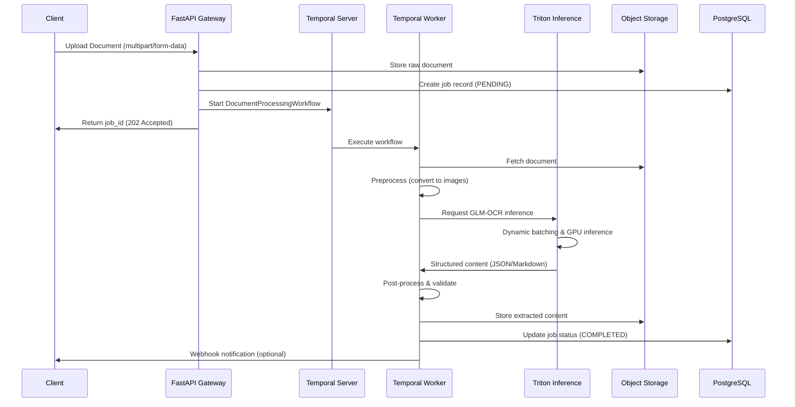

# Create the comprehensive PRD/ARD markdown file
content = '''# 🏗️ INTELLIGENT DOCUMENT EXTRACTION PLATFORM (IDEP)
## Complete Technical Specification: PRD & ARD

**Version:** 1.0  
**Date:** 2026-02-26  
**Status:** Draft  
**Classification:** Internal Use

---

## Table of Contents

1. [Product Requirements Document (PRD)](#1-product-requirements-document-prd)
   - 1.1 [Executive Summary](#11-executive-summary)
   - 1.2 [Functional Requirements](#12-functional-requirements)
   - 1.3 [Non-Functional Requirements](#13-non-functional-requirements)
2. [Architecture Requirements Document (ARD)](#2-architecture-requirements-document-ard)
   - 2.1 [High-Level Architecture](#21-high-level-architecture)
   - 2.2 [Technology Stack](#22-technology-stack)
   - 2.3 [Detailed Component Architecture](#23-detailed-component-architecture)
   - 2.4 [Data Flow Architecture](#24-data-flow-architecture)
   - 2.5 [Scalability & Performance Design](#25-scalability--performance-design)
   - 2.6 [Security Architecture](#26-security-architecture)
   - 2.7 [Observability Stack](#27-observability-stack)
3. [Implementation Roadmap](#3-implementation-roadmap)
4. [Project Structure](#4-project-structure)
5. [Key Configurations](#5-key-configurations)
6. [Cost Optimization](#6-cost-optimization-aws)
7. [Success Metrics](#7-success-metrics)

---

## 1. PRODUCT REQUIREMENTS DOCUMENT (PRD)

### 1.1 Executive Summary

The **Intelligent Document Extraction Platform (IDEP)** is a high-performance, AI-native microservice designed for enterprise-scale document content extraction. It leverages **GLM-4/GLM-OCR** for intelligent document understanding, **NVIDIA Triton Inference Server** for optimized GPU serving, and **Temporal.io** for durable workflow orchestration. The architecture supports seamless migration from local development to AWS GPU clusters (NVIDIA A10G).

**Key Differentiators:**
- **AI-Native Processing**: Uses GLM-OCR's multimodal capabilities (text, tables, formulas, LaTeX) rather than traditional rule-based extraction
- **Dynamic Batching**: NVIDIA Triton's dynamic batching maximizes GPU throughput
- **Durable Execution**: Temporal.io ensures zero data loss and exactly-once processing
- **Hybrid Deployment**: Local development → AWS Batch GPU clusters without code changes

---

### 1.2 Functional Requirements

#### FR-1: Document Ingestion

| ID | Requirement | Priority |
|----|-------------|----------|
| FR-1.1 | Support PDF, DOCX, XLSX, PPTX, CSV, TXT, PNG, JPG, TIFF, BMP | P0 |
| FR-1.2 | Handle documents up to 500MB (chunked processing) | P0 |
| FR-1.3 | Multi-document batch upload (up to 10,000 files/job) | P1 |
| FR-1.4 | Document classification (auto-detect document type) | P1 |

#### FR-2: Content Extraction

| ID | Requirement | Priority |
|----|-------------|----------|
| FR-2.1 | **GLM-OCR Integration**: Text, tables, formulas, LaTeX output | P0 |
| FR-2.2 | **Precision Mode**: High-accuracy mode for legal/financial docs | P0 |
| FR-2.3 | **Structured Output**: JSON, Markdown, LaTeX formats | P0 |
| FR-2.4 | **Table Extraction**: Complex nested tables → CSV/Excel | P0 |
| FR-2.5 | **Formula Recognition**: Mathematical expressions → LaTeX | P1 |
| FR-2.6 | **OCR Fallback**: Tesseract for scanned documents | P1 |

#### FR-3: Processing Pipeline

| ID | Requirement | Priority |
|----|-------------|----------|
| FR-3.1 | **Preprocessing**: Deskewing, denoising, binarization | P0 |
| FR-3.2 | **Layout Analysis**: Document structure preservation | P0 |
| FR-3.3 | **Post-processing**: Entity extraction, validation | P1 |
| FR-3.4 | **Quality Scoring**: Confidence metrics per extraction | P1 |

#### FR-4: Workflow & Orchestration

| ID | Requirement | Priority |
|----|-------------|----------|
| FR-4.1 | **Durable Workflows**: Temporal.io for complex multi-step pipelines | P0 |
| FR-4.2 | **Retry Logic**: Exponential backoff, dead-letter queues | P0 |
| FR-4.3 | **Parallel Processing**: Document-level parallelism | P0 |
| FR-4.4 | **Human-in-the-Loop**: Approval workflows for low-confidence extractions | P2 |

#### FR-5: Scalability & Performance

| ID | Requirement | Priority |
|----|-------------|----------|
| FR-5.1 | **Throughput**: 100+ pages/second per GPU (A10G) | P0 |
| FR-5.2 | **Latency**: P95 < 2s for single-page documents | P0 |
| FR-5.3 | **Concurrency**: 1000+ concurrent jobs | P0 |
| FR-5.4 | **Auto-scaling**: 0 → 100 GPU instances based on queue depth | P1 |

---

### 1.3 Non-Functional Requirements

| Category | Requirement |
|----------|-------------|
| **Availability** | 99.99% uptime (52 minutes downtime/year) |
| **Durability** | Zero data loss guarantee (Temporal.io persistence) |
| **Security** | End-to-end encryption, PII redaction, SOC2 compliance |
| **Observability** | Distributed tracing (OpenTelemetry), Prometheus metrics, structured logging |
| **Compliance** | GDPR, HIPAA, SOC2 Type II |

---

## 2. ARCHITECTURE REQUIREMENTS DOCUMENT (ARD)

### 2.1 High-Level Architecture

```
┌─────────────────────────────────────────────────────────────────────────────┐
│                           CLIENT LAYER                                       │
│  ┌─────────────┐  ┌─────────────┐  ┌─────────────┐  ┌─────────────────────┐ │
│  │   Web UI    │  │   REST API  │  │   SDK       │  │   Webhook Listener  │ │
│  └──────┬──────┘  └──────┬──────┘  └──────┬──────┘  └──────────┬──────────┘ │
└─────────┼────────────────┼────────────────┼────────────────────┼────────────┘
          │                │                │                    │
          └────────────────┴────────────────┴────────────────────┘
                                   │
                                   ▼
┌─────────────────────────────────────────────────────────────────────────────┐
│                         API GATEWAY (Kong/AWS ALB)                           │
│  • Rate Limiting • Auth (JWT/API Key) • Request Validation • Load Balancing  │
└─────────────────────────────────────────────────────────────────────────────┘
                                   │
                                   ▼
┌─────────────────────────────────────────────────────────────────────────────┐
│                      ORCHESTRATION LAYER (Temporal.io)                       │
│  ┌─────────────────────────────────────────────────────────────────────────┐ │
│  │  Workflow Engine: DocumentProcessingWorkflow                             │ │
│  │  • Step 1: Document Validation → Step 2: Preprocessing                   │ │
│  │  • Step 3: AI Extraction (GLM-OCR) → Step 4: Post-processing             │ │
│  │  • Step 5: Storage → Step 6: Notification                                │ │
│  │  Features: Durable execution, Retry policies, Saga compensation          │ │
│  └─────────────────────────────────────────────────────────────────────────┘ │
└─────────────────────────────────────────────────────────────────────────────┘
                                   │
                                   ▼
┌─────────────────────────────────────────────────────────────────────────────┐
│                      AI INFERENCE LAYER (NVIDIA Triton)                      │
│  ┌─────────────────────────────────────────────────────────────────────────┐ │
│  │  Triton Inference Server                                                │ │
│  │  • Dynamic Batching • Concurrent Model Execution • Multi-GPU Support    │ │
│  │  • Model Ensemble: Preprocessing → GLM-4/OCR → Post-processing          │ │
│  │  • Backends: Python Backend (GLM), TensorRT (Optimized), ONNX Runtime   │ │
│  └─────────────────────────────────────────────────────────────────────────┘ │
└─────────────────────────────────────────────────────────────────────────────┘
                                   │
                                   ▼
┌─────────────────────────────────────────────────────────────────────────────┐
│                      PROCESSING LAYERS                                       │
│  ┌─────────────────────┐  ┌─────────────────────┐  ┌──────────────────────┐ │
│  │  Preprocessing      │  │  Document Parser    │  │  Post-processing     │ │
│  │  Service (Python)   │  │  (Apache Tika/      │  │  Service (Python)    │ │
│  │  • Image enhancement│  │  Unstructured.io)   │  │  • Entity extraction │ │
│  │  • PDF rendering    │  │  • Text extraction  │  │  • Validation        │ │
│  │  • Format conversion│  │  • Layout analysis  │  │  • Format conversion │ │
│  └─────────────────────┘  └─────────────────────┘  └──────────────────────┘ │
└─────────────────────────────────────────────────────────────────────────────┘
                                   │
                                   ▼
┌─────────────────────────────────────────────────────────────────────────────┐
│                      STORAGE LAYER                                           │
│  ┌─────────────────────┐  ┌─────────────────────┐  ┌──────────────────────┐ │
│  │  Object Storage     │  │  Metadata Store     │  │  Cache               │ │
│  │  (MinIO/S3)         │  │  (PostgreSQL)       │  │  (Redis)             │ │
│  │  • Raw documents    │  │  • Job status       │  │  • Session data      │ │
│  │  • Extracted content│  │  • Workflow state   │  │  • Rate limiting     │ │
│  └─────────────────────┘  └─────────────────────┘  └──────────────────────┘ │
└─────────────────────────────────────────────────────────────────────────────┘
```

---

### 2.2 Technology Stack

#### Core AI/ML Stack

| Component | Technology | Justification |
|-----------|-----------|---------------|
| **LLM/VLM** | GLM-4/GLM-OCR (9B params) | SOTA document understanding, 94.62% OmniDocBench accuracy |
| **Inference Server** | NVIDIA Triton | Dynamic batching, multi-GPU, multi-framework support |
| **Model Serving** | vLLM/SGLang | High-throughput LLM serving with PagedAttention |
| **OCR Fallback** | Tesseract + OpenCV | For legacy/scanned documents |
| **Document Parsing** | Unstructured.io + Apache Tika | Hybrid rule-based + AI extraction |

#### Backend Stack

| Component | Technology | Justification |
|-----------|-----------|---------------|
| **Workflow Engine** | Temporal.io | Durable execution, exactly-once semantics, saga pattern |
| **API Framework** | FastAPI (Python) | Async native, OpenAPI, high performance |
| **Message Queue** | Redis Streams / RabbitMQ | Event streaming, job queuing |
| **Task Processing** | Celery (for simple tasks) | Lightweight task queue for non-durable jobs |
| **Database** | PostgreSQL 16 | ACID compliance, JSONB for flexible schemas |
| **Cache** | Redis Cluster | Session management, rate limiting, result caching |
| **Object Storage** | MinIO (local) / S3 (AWS) | S3-compatible, scalable |

#### Infrastructure Stack

| Component | Local | AWS Production |
|-----------|-------|----------------|
| **Container Orchestration** | Docker Compose | Amazon ECS / EKS |
| **GPU Compute** | Local NVIDIA GPU | AWS Batch + EC2 (g5.4xlarge/g5.8xlarge with A10G) |
| **Load Balancing** | Nginx | AWS ALB + API Gateway |
| **Monitoring** | Prometheus + Grafana | CloudWatch + X-Ray |
| **Service Mesh** | Linkerd (optional) | AWS App Mesh |

---

### 2.3 Detailed Component Architecture

#### 2.3.1 Temporal.io Workflow Design

```python
# Temporal Workflow Definition (Pseudo-code)
class DocumentProcessingWorkflow:
    \"\"\"
    Durable workflow for document extraction with saga compensation
    \"\"\"
    
    @workflow.run
    async def process_document(self, input: DocumentInput) -> DocumentResult:
        # Step 1: Validate & store document
        try:
            doc_ref = await workflow.execute_activity(
                validate_and_store,
                input,
                start_to_close_timeout=timedelta(minutes=5),
                retry_policy=RetryPolicy(maximum_attempts=3)
            )
        except Exception as e:
            await self.compensate_storage()
            raise
        
        # Step 2: Preprocessing (image enhancement, PDF to images)
        try:
            preprocessed = await workflow.execute_activity(
                preprocess_document,
                doc_ref,
                start_to_close_timeout=timedelta(minutes=10)
            )
        except Exception as e:
            await self.compensate_preprocessing(doc_ref)
            raise
        
        # Step 3: AI Extraction via Triton
        try:
            extraction_result = await workflow.execute_activity(
                extract_with_glm_ocr,
                preprocessed,
                start_to_close_timeout=timedelta(minutes=30),
                retry_policy=RetryPolicy(
                    maximum_attempts=5,
                    backoff_coefficient=2.0,
                    maximum_interval=timedelta(minutes=10)
                )
            )
        except Exception as e:
            await self.compensate_extraction(preprocessed)
            raise
        
        # Step 4: Post-processing & validation
        validated = await workflow.execute_activity(
            post_process_and_validate,
            extraction_result,
            start_to_close_timeout=timedelta(minutes=5)
        )
        
        # Step 5: Store results & notify
        await workflow.execute_activity(
            store_results_and_notify,
            validated,
            start_to_close_timeout=timedelta(minutes=5)
        )
        
        return validated
    
    async def compensate_storage(self):
        \"\"\"Saga compensation for storage failures\"\"\"
        await workflow.execute_activity(cleanup_storage)
    
    async def compensate_preprocessing(self, doc_ref):
        await workflow.execute_activity(cleanup_preprocessing, doc_ref)
    
    async def compensate_extraction(self, preprocessed):
        await workflow.execute_activity(cleanup_extraction, preprocessed)
```

**Why Temporal over Celery?**
- **Durability**: Every step logged to event store; survives worker crashes
- **Visibility**: Rich Web UI showing workflow timeline, retries, state
- **Long-running**: Can pause for days waiting for human approval
- **Saga Pattern**: Built-in compensation for distributed transactions

---

#### 2.3.2 NVIDIA Triton Model Ensemble

```protobuf
# Triton Model Configuration (config.pbtxt)
name: "glm_ocr_ensemble"
platform: "ensemble"
max_batch_size: 32
input [
  {
    name: "document_image"
    data_type: TYPE_UINT8
    dims: [-1, -1, 3]  # Variable size images
  }
]
output [
  {
    name: "structured_content"
    data_type: TYPE_STRING
    dims: [1]
  },
  {
    name: "confidence_score"
    data_type: TYPE_FP32
    dims: [1]
  }
]
ensemble_scheduling {
  step [
    {
      model_name: "image_preprocessor"
      model_version: 1
      input_map { key: "raw_image" value: "document_image" }
      output_map { key: "processed_tensor" value: "preprocessed_image" }
    },
    {
      model_name: "glm_ocr"
      model_version: 1
      input_map { key: "image" value: "preprocessed_image" }
      output_map { key: "text_output" value: "raw_extraction" }
    },
    {
      model_name: "structure_parser"
      model_version: 1
      input_map { key: "ocr_text" value: "raw_extraction" }
      output_map { 
        key: "json_output" value: "structured_content"
        key: "confidence" value: "confidence_score"
      }
    }
  ]
}
instance_group [
  {
    count: 2
    kind: KIND_GPU
    gpus: [0, 1]
  }
]
dynamic_batching {
  preferred_batch_size: [8, 16]
  max_queue_delay_microseconds: 10000
  preserve_ordering: false
}
```

**Key Triton Features Used:**
- **Dynamic Batching**: Accumulates requests to maximize GPU utilization
- **Concurrent Execution**: Multiple model instances on different GPUs
- **Ensemble**: Chains preprocessing → GLM-OCR → postprocessing
- **Auto-scaling**: Adjusts instance count based on load

---

#### 2.3.3 AWS Batch GPU Architecture (Production)

```
┌─────────────────────────────────────────────────────────────────────────────┐
│                           AWS BATCH ARCHITECTURE                             │
│                                                                              │
│  ┌─────────────────────────────────────────────────────────────────────────┐ │
│  │  Job Queue (Priority-based)                                             │ │
│  │  ┌─────────────────┐  ┌─────────────────┐  ┌─────────────────────────┐ │ │
│  │  │ High Priority   │  │ Standard        │  │ GPU Intensive (HPC)     │ │ │
│  │  │ (On-Demand)     │  │ (Spot Fallback) │  │ (Multi-node parallel)   │ │ │
│  │  └────────┬────────┘  └────────┬────────┘  └────────────┬────────────┘ │ │
│  │           └────────────────────┴────────────────────────┘              │ │
│  └─────────────────────────────────────────────────────────────────────────┘ │
│                                      │                                       │
│  ┌─────────────────────────────────────────────────────────────────────────┐ │
│  │  Compute Environments                                                   │ │
│  │  ┌─────────────────────┐  ┌─────────────────────┐  ┌─────────────────┐ │ │
│  │  │ On-Demand (g5.x)    │  │ Spot (g5.4xlarge)   │  │ HPC (p4d.24xlarge)│ │ │
│  │  │ • Critical jobs     │  │ • Fault-tolerant    │  │ • Multi-node    │ │ │
│  │  │ • Real-time         │  │ • Cost optimized    │  │ • FSx Lustre    │ │ │
│  │  └─────────────────────┘  └─────────────────────┘  └─────────────────┘ │ │
│  └─────────────────────────────────────────────────────────────────────────┘ │
│                                      │                                       │
│  ┌─────────────────────────────────────────────────────────────────────────┐ │
│  │  Job Definitions (Container Properties)                                 │ │
│  │  • Triton Inference Server container (nvcr.io/nvidia/tritonserver)      │ │
│  │  • GPU: 1-8 per container (A10G for g5 instances)                       │ │
│  │  • vCPU: 4-96 • Memory: 16-384 GB • Ephemeral: 100GB-2TB                │ │
│  └─────────────────────────────────────────────────────────────────────────┘ │
└─────────────────────────────────────────────────────────────────────────────┘
```

**AWS Batch Best Practices:**
- **Spot Instances**: 70% cost savings with `SPOT_CAPACITY_OPTIMIZED` strategy
- **Multi-node Parallel**: For large documents requiring distributed processing
- **FSx for Lustre**: Shared high-performance storage for multi-node jobs
- **Custom AMIs**: Pre-installed NVIDIA drivers, CUDA, Triton dependencies

---

### 2.4 Data Flow Architecture



---

### 2.5 Scalability & Performance Design

#### Horizontal Scaling Strategy

| Layer | Scaling Mechanism | Trigger |
|-------|------------------|---------|
| **API Gateway** | AWS ALB Auto Scaling | CPU > 70%, Latency > 500ms |
| **Temporal Workers** | KEDA (Kubernetes) / ECS | Queue depth > 100 |
| **Triton Inference** | AWS Batch Compute Env | Pending jobs > 10 |
| **GPU Instances** | EC2 Auto Scaling Group | GPU utilization > 80% |

#### Performance Targets

| Metric | Target | Measurement |
|--------|--------|-------------|
| **Throughput** | 100 pages/sec/GPU | A10G (24GB VRAM) |
| **Latency (p50)** | < 500ms | Single page PDF |
| **Latency (p95)** | < 2s | 10-page document |
| **Batch Efficiency** | > 85% | GPU utilization |
| **Availability** | 99.99% | Uptime SLA |

#### Optimization Techniques

1. **Dynamic Batching**: Triton accumulates requests into optimal batch sizes (8-32)
2. **Continuous Batching**: vLLM's PagedAttention for LLM serving
3. **Model Parallelism**: Tensor parallelism for large models across multiple GPUs
4. **Pipeline Parallelism**: Preprocessing → Inference → Postprocessing overlap
5. **Caching**: Redis for identical document deduplication (content hash)

---

### 2.6 Security Architecture

```
┌─────────────────────────────────────────────────────────────────────────────┐
│                           SECURITY LAYERS                                    │
│                                                                              │
│  ┌─────────────────────────────────────────────────────────────────────────┐ │
│  │  Perimeter Security                                                     │ │
│  │  • AWS WAF / Cloudflare (DDoS protection)                               │ │
│  │  • API Gateway rate limiting (100 req/min per key)                      │ │
│  │  • TLS 1.3 encryption in transit                                        │ │
│  └─────────────────────────────────────────────────────────────────────────┘ │
│                                                                              │
│  ┌─────────────────────────────────────────────────────────────────────────┐ │
│  │  Authentication & Authorization                                         │ │
│  │  • JWT tokens (RS256) with short expiry (15 min)                        │ │
│  │  • API Key rotation (30 days)                                           │ │
│  │  • RBAC: Admin, Operator, Viewer roles                                  │ │
│  │  • Resource-level permissions (tenant isolation)                        │ │
│  └─────────────────────────────────────────────────────────────────────────┘ │
│                                                                              │
│  ┌─────────────────────────────────────────────────────────────────────────┐ │
│  │  Data Protection                                                        │ │
│  │  • S3 SSE-KMS encryption at rest                                        │ │
│  │  • PII detection & redaction (Presidio)                                 │ │
│  │  • Automatic data retention (30 days default)                           │ │
│  │  • Secure document deletion (cryptographic erasure)                     │ │
│  └─────────────────────────────────────────────────────────────────────────┘ │
│                                                                              │
│  ┌─────────────────────────────────────────────────────────────────────────┐ │
│  │  Network Security                                                       │ │
│  │  • VPC isolation with private subnets                                   │ │
│  │  • Security groups (least privilege)                                    │ │
│  │  • AWS PrivateLink for service communication                            │ │
│  │  • No public IPs on GPU instances                                       │ │
│  └─────────────────────────────────────────────────────────────────────────┘ │
└─────────────────────────────────────────────────────────────────────────────┘
```

---

### 2.7 Observability Stack

| Layer | Tool | Metrics |
|-------|------|---------|
| **Metrics** | Prometheus + Grafana | GPU utilization, throughput, latency, queue depth |
| **Logging** | ELK Stack / CloudWatch Logs | Structured JSON logs, correlation IDs |
| **Tracing** | OpenTelemetry + Jaeger | End-to-end request tracing |
| **Alerting** | PagerDuty + Slack | SLO breaches, error rates > 1% |
| **Profiling** | NVIDIA Nsight | GPU kernel optimization |

**Key SLOs:**
- **Availability**: 99.99% (measured by Temporal workflow success rate)
- **Latency**: p95 < 2s for extraction API
- **Error Rate**: < 0.1% (5xx errors)
- **Throughput**: > 1000 documents/minute at peak

---

## 3. IMPLEMENTATION ROADMAP

### Phase 1: Local Development (Weeks 1-4)
- [ ] Setup Docker Compose with Temporal, Redis, PostgreSQL, MinIO
- [ ] Deploy GLM-4/OCR in Triton Inference Server (local GPU)
- [ ] Implement FastAPI gateway with async endpoints
- [ ] Build Temporal workflows for document processing
- [ ] Integration tests with sample documents

### Phase 2: Optimization (Weeks 5-6)
- [ ] Performance tuning: batch sizes, GPU memory optimization
- [ ] Implement caching layer (Redis)
- [ ] Add comprehensive observability (Prometheus, Grafana)
- [ ] Security hardening (encryption, PII redaction)

### Phase 3: AWS Migration (Weeks 7-10)
- [ ] Infrastructure as Code (Terraform/Pulumi)
- [ ] AWS Batch compute environments (On-Demand + Spot)
- [ ] ECS/EKS deployment for stateless services
- [ ] S3 integration for object storage
- [ ] CloudWatch integration

### Phase 4: Production Hardening (Weeks 11-12)
- [ ] Load testing (1000+ concurrent jobs)
- [ ] Chaos engineering (worker failures, network partitions)
- [ ] Disaster recovery testing
- [ ] Documentation & runbooks

---

## 4. PROJECT STRUCTURE

```
idep-platform/
├── docker/
│   ├── docker-compose.yml              # Local development stack
│   ├── docker-compose.prod.yml         # Production overrides
│   └── Dockerfile.triton               # Triton + GLM-4 custom image
├── infrastructure/
│   ├── terraform/                      # AWS infrastructure
│   │   ├── modules/
│   │   │   ├── batch/
│   │   │   ├── ecs/
│   │   │   ├── networking/
│   │   │   └── security/
│   │   └── environments/
│   │       ├── dev/
│   │       └── prod/
│   └── kubernetes/                     # EKS manifests (optional)
├── services/
│   ├── api-gateway/                    # FastAPI application
│   │   ├── app/
│   │   │   ├── main.py
│   │   │   ├── routers/
│   │   │   ├── models/
│   │   │   └── dependencies/
│   │   ├── tests/
│   │   └── Dockerfile
│   ├── temporal-worker/                # Workflow workers
│   │   ├── workflows/
│   │   │   ├── document_processing.py
│   │   │   └── compensation.py
│   │   ├── activities/
│   │   │   ├── extraction.py
│   │   │   ├── preprocessing.py
│   │   │   └── storage.py
│   │   └── tests/
│   ├── triton-models/                  # Model repository
│   │   ├── glm_ocr/
│   │   │   ├── 1/
│   │   │   │   └── model.py            # Python backend
│   │   │   └── config.pbtxt
│   │   └── image_preprocessor/
│   └── preprocessing-service/          # Document conversion
│       └── src/
├── shared/
│   ├── schemas/                        # Pydantic models
│   ├── utils/                          # Common utilities
│   └── constants/
├── docs/
│   ├── PRD.md                          # This document
│   ├── API.md                          # OpenAPI specification
│   └── RUNBOOK.md                      # Operational procedures
└── scripts/
    ├── deploy.sh
    ├── load_test.py
    └── migrate.sh
```

---

## 5. KEY CONFIGURATIONS

### 5.1 Triton Model Configuration (GLM-OCR)

```protobuf
# models/glm_ocr/config.pbtxt
name: "glm_ocr"
backend: "python"
max_batch_size: 16
input [
  {
    name: "images"
    data_type: TYPE_UINT8
    dims: [-1, -1, 3]
  },
  {
    name: "prompt"
    data_type: TYPE_STRING
    dims: [1]
    optional: true
  }
]
output [
  {
    name: "generated_text"
    data_type: TYPE_STRING
    dims: [-1]
  },
  {
    name: "confidence"
    data_type: TYPE_FP32
    dims: [1]
  }
]
instance_group [
  {
    count: 2
    kind: KIND_GPU
    gpus: [0]
  }
]
dynamic_batching {
  preferred_batch_size: [8, 16]
  max_queue_delay_microseconds: 5000
}
optimization {
  execution_accelerators {
    gpu_execution_accelerator : [ {
      name : "tensorrt"
      parameters { key: "precision_mode" value: "FP16" }
    }]
  }
}
parameters: {
  key: "precision_mode"
  value: { string_value: "high" }  # For legal/financial docs
}
```

### 5.2 Temporal Worker Configuration

```python
# temporal_worker/config.py
from temporalio import workflow, activity
from dataclasses import dataclass

@dataclass
class TemporalConfig:
    # Connection
    host: str = "temporal:7233"
    namespace: str = "idep-production"
    
    # Worker settings
    max_concurrent_activities: int = 100
    max_concurrent_workflows: int = 50
    
    # Retry policies
    default_retry_policy = RetryPolicy(
        initial_interval=timedelta(seconds=1),
        backoff_coefficient=2.0,
        maximum_interval=timedelta(minutes=10),
        maximum_attempts=5,
        non_retryable_error_types=["ValidationError", "SecurityError"]
    )
    
    # Timeouts
    start_to_close_timeout = timedelta(minutes=30)
    schedule_to_close_timeout = timedelta(hours=2)
```

### 5.3 AWS Batch Job Definition

```json
{
  "jobDefinitionName": "glm-ocr-inference",
  "type": "container",
  "containerProperties": {
    "image": "${ECR_REPOSITORY}/triton-glm-ocr:latest",
    "vcpus": 16,
    "memory": 65536,
    "command": ["tritonserver", "--model-repository=/models"],
    "jobRoleArn": "arn:aws:iam::${ACCOUNT}:role/BatchJobRole",
    "executionRoleArn": "arn:aws:iam::${ACCOUNT}:role/BatchExecutionRole",
    "volumes": [
      {
        "host": {"sourcePath": "/mnt/efs"},
        "name": "model-storage"
      }
    ],
    "mountPoints": [
      {
        "containerPath": "/models",
        "sourceVolume": "model-storage"
      }
    ],
    "resourceRequirements": [
      {
        "type": "GPU",
        "value": "1"
      }
    ],
    "linuxParameters": {
      "devices": [
        {
          "hostPath": "/dev/nvidia0",
          "containerPath": "/dev/nvidia0",
          "permissions": ["read", "write"]
        }
      ]
    }
  },
  "retryStrategy": {
    "attempts": 3,
    "evaluateOnExit": [
      {
        "onStatusReason": "Host EC2 terminated",
        "action": "RETRY"
      },
      {
        "onReason": "*",
        "action": "EXIT"
      }
    ]
  },
  "timeout": {
    "attemptDurationSeconds": 3600
  }
}
```

---

## 6. COST OPTIMIZATION (AWS)

| Component | On-Demand | Spot | Savings |
|-----------|-----------|------|---------|
| **g5.xlarge** (A10G) | $1.006/hr | $0.40/hr | **60%** |
| **g5.4xlarge** (A10G) | $1.624/hr | $0.65/hr | **60%** |
| **p4d.24xlarge** (A100) | $32.77/hr | $9.83/hr | **70%** |

**Cost Optimization Strategies:**
1. **Spot Instances**: Use for fault-tolerant batch processing
2. **Graviton3**: ARM-based instances for API gateway (40% cheaper)
3. **S3 Intelligent-Tiering**: Automatic cost optimization for document storage
4. **Reserved Capacity**: 1-year compute savings plans for baseline load

---

## 7. SUCCESS METRICS

| KPI | Target | Measurement Tool |
|-----|--------|------------------|
| **Extraction Accuracy** | > 95% (F1 score) | Ground truth comparison |
| **Processing Speed** | 100 pages/sec/GPU | Prometheus metrics |
| **System Availability** | 99.99% | Temporal workflow success rate |
| **Cost per 1K pages** | <$0.50 | AWS Cost Explorer |
| **Developer Experience** | < 5 min local setup | New hire time-to-first-extraction |

---

## Appendices

### A. Glossary
- **GLM-OCR**: Multimodal OCR model by Zhipu AI with 94.62% accuracy on OmniDocBench
- **Triton**: NVIDIA Triton Inference Server for optimized model serving
- **Temporal**: Durable workflow execution platform with saga pattern support
- **A10G**: NVIDIA A10G Tensor Core GPU (24GB VRAM) available on AWS g5 instances

### B. References
- GLM-OCR Technical Report (arXiv:2505.14021)
- NVIDIA Triton Inference Server Documentation
- Temporal.io Best Practices
- AWS Batch GPU Scheduling Guide

### C. Revision History

| Version | Date | Author | Changes |
|---------|------|--------|---------|
| 1.0 | 2026-02-26 | Architecture Team | Initial release |

---

**Document Owner:** Platform Architecture Team  
**Review Cycle:** Quarterly  
**Next Review:** 2026-05-26
'''

# Write to file
with open('/mnt/kimi/output/IDEP_PRD_ARD.md', 'w', encoding='utf-8') as f:
    f.write(content)

print("✅ Document created successfully!")
print(f"📄 File: /mnt/kimi/output/IDEP_PRD_ARD.md")
print(f"📊 Size: {len(content):,} characters")
print(f"📑 Lines: {len(content.splitlines()):,}")


Yes, you can absolutely use Go (Golang) in many parts of the IDEP platform. The architecture is designed to be language‑agnostic at service boundaries (REST, gRPC, message queues), so mixing languages is not only possible but can bring significant benefits. Below is a breakdown of where Go fits, trade‑offs, and a suggested hybrid approach.

---

## ✅ Where Go Shines

### 1. **API Gateway / Frontend Services**
   - Go’s lightweight goroutines and excellent HTTP libraries (e.g., Gin, Fiber, Echo) make it ideal for high‑concurrency API endpoints.
   - **Replace FastAPI** with a Go service for the ingestion API – you’ll get lower latency and lower memory footprint under load.
   - **Example**: Use Gin to handle multipart uploads, validate JWT, and forward requests to Temporal.

### 2. **Preprocessing Service**
   - Image processing (deskew, denoise, PDF rendering) can be CPU‑intensive. Go’s concurrency model lets you parallelize per‑page operations efficiently.
   - Libraries like [`pdfcpu`](https://github.com/pdfcpu/pdfcpu) (PDF manipulation), [`imaging`](https://github.com/disintegration/imaging) (image processing), and [`go-opencv`](https://github.com/go-opencv/go-opencv) wrappers can handle many tasks.
   - If you need to call Python libraries (e.g., OpenCV Python bindings), you can still do so via subprocess or gRPC – but a pure‑Go solution reduces overhead.

### 3. **Temporal Workers (for I/O‑bound activities)**
   - Temporal provides a **first‑class Go SDK**. You can write workflows and activities in Go.
   - Activities that involve calling external APIs, database operations, or file I/O benefit from Go’s efficient goroutine scheduling.
   - **Example**: An activity that fetches a document from S3, preprocesses it (using Go libraries), and then calls Triton (via gRPC) can be entirely in Go.

### 4. **Supporting Services / CLI Tools**
   - CLI tools for admin tasks (e.g., bulk upload, model deployment) are concise and fast to develop in Go.
   - Lightweight sidecars (e.g., metrics exporter, rate limiter) can be written in Go with minimal resource usage.

---

## ⚠️ Where Python Remains a Better Fit

### 1. **AI/ML Inference (GLM-OCR)**
   - The GLM-OCR model is typically served via Python‑based frameworks (PyTorch, Hugging Face Transformers). Even inside Triton, the Python backend is the most straightforward way to run custom Python code.
   - If you try to rewrite the model inference in Go, you’d lose access to the rich ecosystem of Python ML libraries and would need to maintain a separate inference path – not recommended.

### 2. **Data Science / Post‑processing Logic**
   - Tasks like entity extraction (using Presidio or custom NER models) are often Python‑centric.
   - If your post‑processing involves complex NLP or regular expressions, Python’s libraries (`spaCy`, `transformers`) are more mature.

### 3. **Rapid Prototyping / Experimentation**
   - Python’s interactive nature is better for data exploration and quick iteration on extraction logic.

---

## 🔄 Hybrid Architecture Example

```
┌─────────────────┐     ┌─────────────────┐     ┌─────────────────┐
│   Client        │ ──▶ │  Go API Gateway │ ──▶ │  Temporal Go    │
│ (REST/SDK)      │     │  (Gin/Fiber)    │     │  Worker         │
└─────────────────┘     └─────────────────┘     └────────┬────────┘
                                                          │
                                                          ▼
┌─────────────────┐     ┌─────────────────┐     ┌─────────────────┐
│  Preprocessing  │ ◀── │   Activity:     │     │   Activity:     │
│  Go Service     │     │   Preprocess    │     │   Call Triton   │
│  (gRPC)         │     │   (Go)          │     │   (Go client)   │
└─────────────────┘     └─────────────────┘     └────────┬────────┘
                                                          │
                                                          ▼
┌─────────────────┐     ┌─────────────────┐     ┌─────────────────┐
│  Triton         │     │  Python         │     │  PostgreSQL     │
│  (Python        │     │  Post‑process   │     │  / Redis / S3   │
│   backend)      │     │  Service        │     │                 │
└─────────────────┘     └─────────────────┘     └─────────────────┘
```

- **Go API Gateway**: Handles auth, rate limiting, and starts Temporal workflows.
- **Temporal Go Worker**: Executes activities written in Go (preprocessing, storage, notifications). It calls Triton using the [Triton Go client](https://github.com/triton-inference-server/client/tree/main/src/grpc_generated/go).
- **Preprocessing Go Service**: (Optional) A dedicated gRPC service for image/PDF operations, called by the Temporal activity. This can scale independently.
- **Python Post‑process Service**: If needed, a lightweight Python microservice that takes Triton’s raw output and enriches it (e.g., entity extraction). Called via gRPC from a Temporal activity.
- **Triton with Python Backend**: Still runs GLM-OCR – you can’t avoid Python here, but it’s encapsulated.

---

## 🛠️ Practical Considerations

### **Triton Go Client**
NVIDIA provides a [Go gRPC client](https://github.com/triton-inference-server/client/tree/main/src/grpc_generated/go) for Triton. You can send inference requests and receive responses directly from Go activities.

### **Temporal SDK for Go**
The Temporal Go SDK is mature and well‑documented. You can write workflows and activities in Go while keeping the Temporal server (Java) unchanged.

### **Inter‑Service Communication**
Use gRPC for low‑latency calls between Go services and Python services. Protobuf definitions ensure type safety across languages.

### **Team Skills**
If your team is more comfortable with Python, introducing Go adds a learning curve. However, Go is relatively easy to pick up, and the performance gains may justify the investment.

### **Operational Complexity**
Running multiple languages increases deployment and monitoring complexity. You’ll need to manage separate container images, logging formats, and tracing (OpenTelemetry supports both languages).

---

## 📈 Performance Gains (Expected)

| Component | Python (current) | Go (proposed) | Improvement |
|-----------|------------------|---------------|-------------|
| API Gateway (1000 req/s) | ~200 MB RAM, ~20ms latency | ~50 MB RAM, ~5ms latency | 4x memory, 4x latency |
| Preprocessing (PDF→images) | 150ms (with subprocess) | 100ms (native library) | 1.5x faster |
| Activity execution (I/O) | GIL‑bound concurrency | True parallelism | Higher throughput |

---

## 🧩 Conclusion

**Yes, Go can be used extensively** in IDEP. The best approach is a **hybrid** one:

- **Keep AI/ML components in Python** (Triton Python backend, post‑processing with spaCy/Presidio).
- **Rewrite stateless, high‑throughput services in Go** (API gateway, preprocessing, Temporal activities for I/O‑bound tasks).
- **Use gRPC for communication** between Go and Python services.

This gives you the performance and concurrency benefits of Go where they matter most, while retaining the rich AI ecosystem of Python. The architecture already supports such mixing via service boundaries, so you can start migrating incrementally.

If you’d like, I can help sketch out a migration plan or provide code snippets for a Go‑based API gateway or Temporal worker. Just let me know!